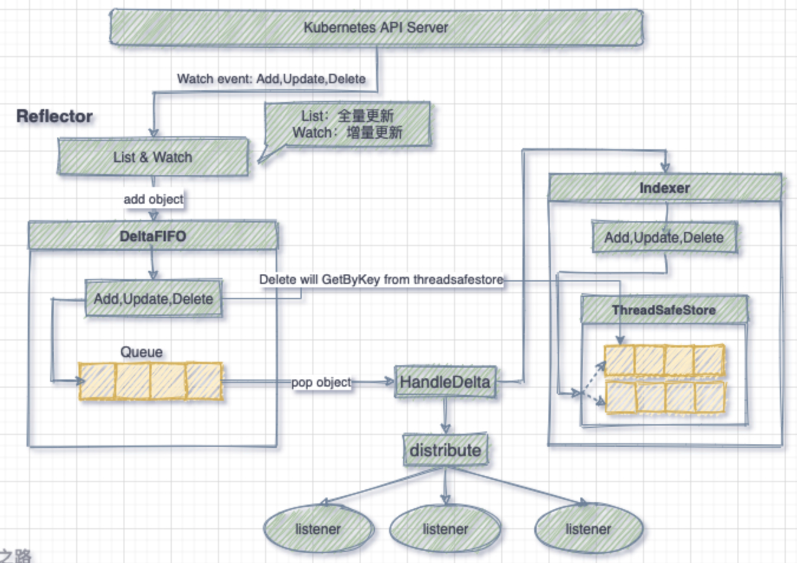

# 🇦🇲 Informer

### 前言

在kubernetes中各组件是通过HTTP协议进行通讯的，而组件间的通信也并没有依赖任何中间件，那么如何保证消息的实时性、可靠性、顺序性呢？**Informer 机制**很好的解决了这个问题。Kubernetes 中各组件与 API Server 的通信都是通过 client-go 的 informer 机制来保证和完成的。

### 控制器模式

控制器模式最核心的就是控制循环的概念。而 Informer 机制，也就是控制循环中负责观察系统的传感器（Sensor）主要由 Reflector、Informer、Indexer 三个组件构成。其与各种资源的 Controller 相配合，就可以完成完整的控制循环，不断的使系统向终态趋近 `status` -> `spec`。

### Informer机制

#### 1、Informer 设计中的关键点

**为了让 Client-go 更快地返回 List/Get 请求的结果、减少对 Kubenetes API 的直接调用，Informer 被设计实现为一个依赖 Kubernetes List/Watch API 、可监听事件并触发回调函数的二级缓存工具包。**

所谓 informer，其实就是一个带有本地缓存和索引机制的，可以注册 EventHandler 的 client，目的是为了减轻频繁通信 API Server 的压力而抽取出来的一层 cache，客户端对 API Server 数据的**读取**和**监测**操作都通过本地的 informer 来进行。

#### 2、更快地返回 List/Get 请求，减少对 Kubenetes API 的直接调用

**使用 Informer 实例的 Lister() 方法， List/Get Kubernetes 中的 Object 时，Informer 不会去请求 Kubernetes API，而是直接查找缓存在本地内存中的数据(这份数据由 Informer 自己维护)。通过这种方式，Informer 既可以更快地返回结果，又能减少对 Kubernetes API 的直接调用。**

定义不同资源的 Informer，允许监控不同资源事件。同时为了避免同一资源的 Informer 被实例化多次，而每个 Informer 都会使用一个 Reflector，这样会运行过多相同的 ListAndWatch，从而加重 API Server 的压力，Informer 还提供了共享机制，多个 Informer 可以共享一个 Reflector，从而达到节约资源的目的。

#### 3、依赖 Kubernetes List/Watch API

**Informer 只会调用 Kubernetes List 和 Watch 两种类型的 API。Informer 在初始化的时，先调用 Kubernetes List API 获得某种 resource 的全部 Object，缓存在内存中; 然后，调用 Watch API 去 watch 这种 resource，去维护这份缓存; 最后，Informer 就不再调用 Kubernetes 的任何 API。**

**用 List/Watch 去维护缓存、保持一致性是非常典型的做法，但令人费解的是，Informer 只在初始化时调用一次 List API，之后完全依赖 Watch API 去维护缓存，没有任何 resync 机制。**

**笔者在阅读 Informer 代码时候，对这种做法十分不解。按照多数人思路，通过 resync 机制，重新 List 一遍 resource 下的所有 Object，可以更好的保证 Informer 缓存和 Kubernetes 中数据的一致性。**

**4、可监听事件并触发回调函数**

**Informer 通过 Kubernetes Watch API 监听某种 resource 下的所有事件。而且，Informer 可以添加自定义的回调函数，这个回调函数实例(即 ResourceEventHandler 实例)只需实现 OnAdd(obj interface{}) OnUpdate(oldObj, newObj interface{}) 和 OnDelete(obj interface{}) 三个方法，这三个方法分别对应 informer 监听到创建、更新和删除这三种事件类型。**

<figure><figcaption>
Informer 机制
</figcaption></figure>

### Reflector

Reflector 用于监测制定 Kubernetes 资源，当资源发生变化时，触发相应的事件，如：Added（资源添加）事件、Update（资源更新）事件、Delete（资源删除）事件，并将事件及资源名称添加到 DeltaFIFO 中。

<figure><figcaption></figcaption></figure>

### DeltaFIFO

DeltaFIFO 顾名思义，Delta 是一个资源对象存储，可以保持操作类型（Add、Update、Delete、Sync等）；而 FIFO 则是一个先进先出的队列。其是一个生产者与消费者的队列，其中 Reflector 是生产者，消费者则调用 `Pop()` 方法取出最早进入队列的对象数据。

### Indexer 

Indexer 是 client-go 用来存储资源对象并自带索引功能的本地存储，Reflector 从 DeltaFIFO 中将消费出来的资源对象存储至 Indexer。同时 Indexer 中的数据与 Etcd 中的数据保持完全一致。client-go 可以很方便的从本次存储中读取相应的资源对象数据，而无需每次都从远程 Etcd 集群中读取，从而降低了 API Server 和 Etcd 集群的压力。

### 详细解析

#### Informer 内部主要组件

Informer 中主要包含 Controller、Reflector、DeltaFIFO、LocalStore、Lister 和 Processor 六个组件，其中 Controller 并不是 Kubernetes Controller，这两个 Controller 并没有任何联系；Reflector 的主要作用是通过 Kubernetes Watch API 监听某种 resource 下的所有事件；DeltaFIFO 和 LocalStore 是 Informer 的两级缓存；Lister 主要是被调用 List/Get 方法；Processor 中记录了所有的回调函数实例(即 ResourceEventHandler 实例)，并负责触发这些函数。

#### Informer 关键逻辑解析

1. Informer 在初始化时，Reflector 会先 List API 获得所有的 Pod
2. Reflect 拿到全部 [Pod](https://www.kubernetes.org.cn/tags/pod) 后，会将全部 Pod 放到 Store 中
3. 如果有人调用 Lister 的 List/Get 方法获取 Pod， 那么 Lister 会直接从 Store 中拿数据
4.

    <figure><figcaption></figcaption></figure>

5. Informer 初始化完成之后，Reflector 开始 Watch Pod，监听 Pod 相关 的所有事件;如果此时 pod\_1 被删除，那么 Reflector 会监听到这个事件
6. Reflector 将 pod\_1 被删除 的这个事件发送到 DeltaFIFO
7. DeltaFIFO 首先会将这个事件存储在自己的数据结构中(实际上是一个 queue)，然后会直接操作 Store 中的数据，删除 Store 中的 pod\_1
8. DeltaFIFO 再 Pop 这个事件到 Controller 中
9.

    <figure><figcaption></figcaption></figure>

10. Controller 收到这个事件，会触发 Processor 的回调函数

<figure><figcaption></figcaption></figure>

LocalStore 会周期性地把所有的 Pod 信息重新放到 DeltaFIFO 中

