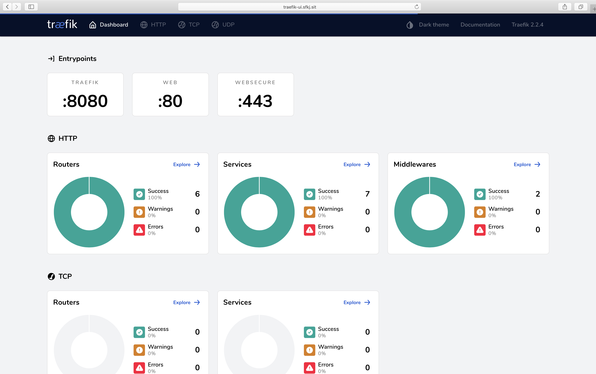
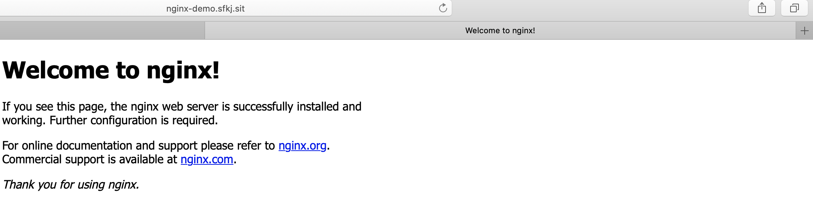

# 🍌 Ingress

## 1、Ingress 简介

### 1.1、理解Ingress

ingress就是从kubernetes集群外访问集群的入口，将用户的URL请求转发到不同的service上。Ingress相当于nginx、apache等负载均衡方向代理服务器，其中还包括规则定义，即URL的路由信息，路由信息得的刷新由[Ingress controller](https://kubernetes.io/docs/concepts/services-networking/ingress/#ingress-controllers)来提供。

### 1.2、理解Ingress controller

Ingress Controller 实质上可以理解为是个监视器，Ingress Controller 通过不断地跟 kubernetes API 打交道，实时的感知后端 service、pod 等变化，比如新增和减少 pod，service 增加与减少等；当得到这些变化信息后，Ingress Controller 再结合下文的 Ingress 生成配置，然后更新反向代理负载均衡器，并刷新其配置，达到服务发现的作用。

## 2、Ingress controller&#x20;

### 2.1、Ingress controller 对比


## 3、Traefik

### 3.1、介绍traefik

[Traefik](https://traefik.io/)是一款开源的反向代理与负载均衡工具。它最大的优点是能够与常见的微服务系统直接整合，可以实现自动化动态配置。目前支持Docker, Swarm, Mesos/Marathon, Mesos, Kubernetes, Consul, Etcd, Zookeeper, BoltDB, Rest API等等后端模型。

### 3.2、架构图


### 3.3、部署traefik

参考官方文档，yaml如下





```yaml
apiVersion: apiextensions.k8s.io/v1beta1
kind: CustomResourceDefinition
metadata:
  name: ingressroutes.traefik.containo.us

spec:
  group: traefik.containo.us
  version: v1alpha1
  names:
    kind: IngressRoute
    plural: ingressroutes
    singular: ingressroute
  scope: Namespaced

---
apiVersion: apiextensions.k8s.io/v1beta1
kind: CustomResourceDefinition
metadata:
  name: middlewares.traefik.containo.us

spec:
  group: traefik.containo.us
  version: v1alpha1
  names:
    kind: Middleware
    plural: middlewares
    singular: middleware
  scope: Namespaced

---
apiVersion: apiextensions.k8s.io/v1beta1
kind: CustomResourceDefinition
metadata:
  name: ingressroutetcps.traefik.containo.us

spec:
  group: traefik.containo.us
  version: v1alpha1
  names:
    kind: IngressRouteTCP
    plural: ingressroutetcps
    singular: ingressroutetcp
  scope: Namespaced

---
apiVersion: apiextensions.k8s.io/v1beta1
kind: CustomResourceDefinition
metadata:
  name: ingressrouteudps.traefik.containo.us

spec:
  group: traefik.containo.us
  version: v1alpha1
  names:
    kind: IngressRouteUDP
    plural: ingressrouteudps
    singular: ingressrouteudp
  scope: Namespaced

---
apiVersion: apiextensions.k8s.io/v1beta1
kind: CustomResourceDefinition
metadata:
  name: tlsoptions.traefik.containo.us

spec:
  group: traefik.containo.us
  version: v1alpha1
  names:
    kind: TLSOption
    plural: tlsoptions
    singular: tlsoption
  scope: Namespaced

---
apiVersion: apiextensions.k8s.io/v1beta1
kind: CustomResourceDefinition
metadata:
  name: tlsstores.traefik.containo.us

spec:
  group: traefik.containo.us
  version: v1alpha1
  names:
    kind: TLSStore
    plural: tlsstores
    singular: tlsstore
  scope: Namespaced

---
apiVersion: apiextensions.k8s.io/v1beta1
kind: CustomResourceDefinition
metadata:
  name: traefikservices.traefik.containo.us

spec:
  group: traefik.containo.us
  version: v1alpha1
  names:
    kind: TraefikService
    plural: traefikservices
    singular: traefikservice
  scope: Namespaced

---
kind: ClusterRole
apiVersion: rbac.authorization.k8s.io/v1beta1
metadata:
  name: traefik-ingress-controller

rules:
  - apiGroups:
      - ""
    resources:
      - services
      - endpoints
      - secrets
    verbs:
      - get
      - list
      - watch
  - apiGroups:
      - extensions
    resources:
      - ingresses
    verbs:
      - get
      - list
      - watch
  - apiGroups:
      - extensions
    resources:
      - ingresses/status
    verbs:
      - update
  - apiGroups:
      - traefik.containo.us
    resources:
      - middlewares
      - ingressroutes
      - traefikservices
      - ingressroutetcps
      - ingressrouteudps
      - tlsoptions
      - tlsstores
    verbs:
      - get
      - list
      - watch

---
kind: ClusterRoleBinding
apiVersion: rbac.authorization.k8s.io/v1beta1
metadata:
  name: traefik-ingress-controller

roleRef:
  apiGroup: rbac.authorization.k8s.io
  kind: ClusterRole
  name: traefik-ingress-controller
subjects:
  - kind: ServiceAccount
    name: traefik-ingress-controller
    namespace: kube-system
```



```yaml
kind: ConfigMap
apiVersion: v1
metadata:
  name: traefik-config
  namespace: kube-system
#  namespace: kube-system
data:
  traefik.yaml: |-
    ping: ""                    ## 启用 Ping
    serversTransport:
      insecureSkipVerify: false  ## Traefik 忽略验证代理服务的 TLS 证书
    api:
      insecure: true            ## 允许 HTTP 方式访问 API
      dashboard: true           ## 启用 Dashboard
      debug: false              ## 启用 Debug 调试模式
    metrics:
      prometheus: ""            ## 配置 Prometheus 监控指标数据，并使用默认配置
    entryPoints:
      web:
        address: ":80"          ## 配置 80 端口，并设置入口名称为 web
      websecure:
        address: ":443"         ## 配置 443 端口，并设置入口名称为 websecure
    providers:
      kubernetesCRD: ""         ## 启用 Kubernetes CRD 方式来配置路由规则
      kubernetesIngress: ""     ## 启动 Kubernetes Ingress 方式来配置路由规则
    log:
      filePath: ""              ## 设置调试日志文件存储路径，如果为空则输出到控制台
      level: error              ## 设置调试日志级别
      format: json              ## 设置调试日志格式
    accessLog:
      filePath: ""              ## 设置访问日志文件存储路径，如果为空则输出到控制台
      format: json              ## 设置访问调试日志格式
      bufferingSize: 0          ## 设置访问日志缓存行数
      filters:
        #statusCodes: ["200"]   ## 设置只保留指定状态码范围内的访问日志
        retryAttempts: true     ## 设置代理访问重试失败时，保留访问日志
        minDuration: 20         ## 设置保留请求时间超过指定持续时间的访问日志
      fields:                   ## 设置访问日志中的字段是否保留（keep 保留、drop 不保留）
        defaultMode: keep       ## 设置默认保留访问日志字段
        names:                  ## 针对访问日志特别字段特别配置保留模式
          ClientUsername: drop
        headers:                ## 设置 Header 中字段是否保留
          defaultMode: keep     ## 设置默认保留 Header 中字段
          names:                ## 针对 Header 中特别字段特别配置保留模式
            User-Agent: redact
            Authorization: drop
            Content-Type: keep
```



```yaml
apiVersion: v1
kind: ServiceAccount
metadata:
  namespace: kube-system
  name: traefik-ingress-controller

---
kind: DaemonSet
apiVersion: apps/v1
metadata:
  namespace: kube-system
  name: traefik
  labels:
    app: traefik

spec:
  selector:
    matchLabels:
      app: traefik
  template:
    metadata:
      labels:
        app: traefik
    spec:
      serviceAccountName: traefik-ingress-controller
      containers:
        - name: traefik
          image: traefik:v2.2
          args:
            - --configfile=/config/traefik.yaml
          volumeMounts:
            - mountPath: "/config"
              name: "config"

          ports:
            - name: web
              containerPort: 80
              hostPort: 8181
            - name: websecure
              containerPort: 443
              hostPort: 8443
            - name: admin
              containerPort: 8080
      volumes:
        - name: config
          configMap:
            name: traefik-config
```



```yaml
apiVersion: v1
kind: Service
metadata:
  name: traefik-ui-service
  namespace: kube-system

spec:
  type: NodePort
  selector:
    app: traefik
  ports:
    - protocol: TCP
      name: web
      port: 8000
    - protocol: TCP
      name: admin
      port: 8080
    - protocol: TCP
      name: websecure
      port: 4443
```



```yaml
apiVersion: extensions/v1beta1
kind: Ingress
metadata:
  name: traefik-ui-ingress
  namespace: kube-system
  annotations:
    kubernetes.io/ingress.class: traefik
spec:
  rules:
  - host: traefik-ui.sfkj.sit
    http:
      paths:
      - path: /
        backend:
          serviceName: traefik-ui-service
          servicePort: 8080
```



#### yaml文件 可在以下github获取


traefik yaml


#### 部署traefik到kubernetes集群

使用本地文件

```bash
kubectl apply -f traefik-rbac.yaml
kubectl apply -f traefik-configmap.yaml
kubectl apply -f traefik-daemonset.yaml
kubectl apply -f traefik-ui-service.yaml
kubectl apply -f traefik-ui-ingress.yaml
```

使用git地址

```bash
kubectl apply -f https://raw.githubusercontent.com/zhaolibingit/it_island/master/kubernetes/ingress/traefik/traefik-rbac.yaml
kubectl apply -f https://raw.githubusercontent.com/zhaolibingit/it_island/master/kubernetes/ingress/traefik/traefik-configmap.yaml
kubectl apply -f https://raw.githubusercontent.com/zhaolibingit/it_island/master/kubernetes/ingress/traefik/traefik-daemonset.yaml
kubectl apply -f https://raw.githubusercontent.com/zhaolibingit/it_island/master/kubernetes/ingress/traefik/traefik-ui-service.yaml
kubectl apply -f https://raw.githubusercontent.com/zhaolibingit/it_island/master/kubernetes/ingress/traefik/traefik-ui-ingress.yaml
```

### 3.3、配置边缘节点服务器

现使用nginx代理

```bash
# 安装nginx
yum install nginx -y

# cat  /etc/nginx/conf.d/sfkj.sit.conf
# 注意server地址为daemonset hostport
upstream default_backend_traefik {
    server 10.0.0.32:8181    max_fails=3 fail_timeout=10s;
    server 10.0.0.33:8181    max_fails=3 fail_timeout=10s;
    #server 10.105.28.224:8080   max_fails=3 fail_timeout=10s;
}
server {
    listen 80;
    server_name *.sfkj.sit;

    location / {
        proxy_pass http://default_backend_traefik;
        proxy_set_header Host       $http_host;
        proxy_set_header x-forwarded-for $proxy_add_x_forwarded_for;
    }
}

# 启动以及开机自启动
systemctl start nginx
systemctl start nginx
```

自定义域名 访问机器可使用本地/etc/hosts 或者使用内网dns,将以下加入本机/etc/hosts

#### `10.0.0.31 traefik-ui.sfkj.sit`

#### 部署完成后在浏览器访问 `http://traefik-ui.sfkj.sit`



### 3.4、部署nginx-demo

yaml如下


nginx-demo.yaml




```yaml
apiVersion: apps/v1
kind: Deployment
metadata:
    name: nginx-demo-deployment
    labels:
        app: nginx-demo

spec:
    replicas: 2
    selector:
        matchLabels:
            app: nginx-demo
    template:
        metadata:
            labels:
                app: nginx-demo
        spec:
            containers:
                - name: nginx
                  image: nginx:1.14-alpine
                  imagePullPolicy: IfNotPresent
                  ports:
                      - containerPort: 80

---
apiVersion: v1
kind: Service
metadata:
    name: nginx-demo-svc
    namespace: default
spec:
    selector:
        app: nginx-demo
    type: ClusterIP
    ports:
        - name: nginx-demo-web
          port: 80
          protocol: TCP

---
apiVersion: extensions/v1beta1
kind: Ingress
metadata:
    name: nginx-demo-ingress
    namespace: default
    annotations:
        kubernetes.io/ingress.class: traefik
spec:
    rules:
        - host: nginx-demo.sfkj.sit
          http:
              paths:
                  - path: /
                    backend:
                        serviceName: nginx-demo-svc
                        servicePort: 80
```



#### 部署到k8s集群

```bash
kubectl apply -f https://raw.githubusercontent.com/zhaolibingit/it_island/master/kubernetes/ingress/traefik/nginx-demo.yaml
```

自定义域名 访问机器可使用本地/etc/hosts 或者使用内网dns,将以下加入本机/etc/hosts

#### `10.0.0.31 nginx-demo.sfkj.sit`

#### 部署完成后在浏览器访问 `http://nginx-demo.sfkj.sit`



至此traefik已配置成功。


### 4、Nginx Ingress

#### 介绍

[NGINX Ingress Controller](https://kubernetes.github.io/ingress-nginx/) 是ingress controller通过和kubernetes api交互，动态的去感知集群中ingress规则变化，然后读取它，按照自定义的规则，规则就是写明了哪个域名对应哪个service，生成一段nginx配置，再写到nginx-ingress-control的pod里，这个Ingress controller的pod里运行着一个Nginx服务，控制器会把生成的nginx配置写入/etc/nginx.conf文件中，然后reload一下使配置生效。以此达到域名分配置和动态更新的问题。

#### 参考链接:

* [**Kubernetes实战：集群中部署NGINX Ingress Controller**](https://www.jianshu.com/p/613967aee68e)
* [**浅谈 k8s ingress controller 选型**](https://zhuanlan.zhihu.com/p/109458069)
