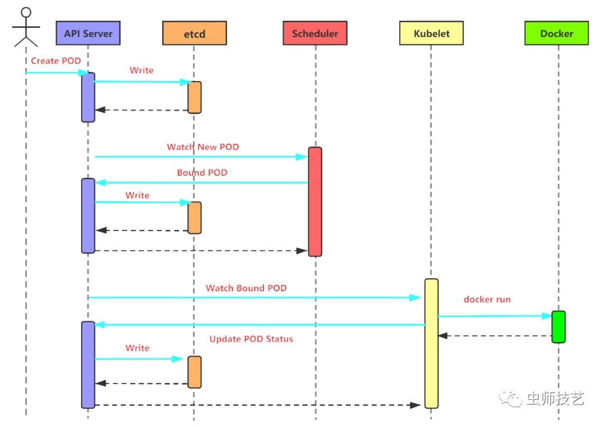

# 🍊 Pod 创建流程

## Kubernetes创建Pod的工作流程有如下图所示的几个阶段

<figure><figcaption>
Pod 创建流程
</figcaption></figure>

#### **第一步：**用户通过kubectl等接口提交创建Pod的yaml文件，向Kubernetes系统发起资源请求

#### **第二步：**Api-server接收到用户请求之后，会做出相应的认证，然后检查信息并且将元数据信息存储到etcd中，创建Pod资源初始化，这是第一次写etcd动作

#### **第三步：**Scheduler通过list-watch的监听机制，查看要创建Pod资源，APIServer会立即把创建Pod的消息通知Scheduler，Scheduler发现Pod的属性中Dest Node为空时（Dest Node=””），便会立即触发调度流程进行调度。而调度流程分为以下几个步骤，如下图：

* **3.1. 过滤**：首先是kube-scheduler调度器用一组规则过滤掉不满足条件的主机，这个过程称为predicate，比如明确指定所需要的资源类型，这样就可以过滤掉不满足条件的主机。**Predicate**有一系列的算法可以使用：
  * PodToleratesNodeTaints：检查Pod是否容忍Node Taints
  * CheckNodeMemoryPressure:检查Pod是否可以调度到MemoryPressure的节点上
  * CheckNodeDiskPressure：检查Pod是否可以调度到DiskPressure的节点上
  * NoVolumeNodeConflict：检查节点是否满足Pod所引用的Volume的条件
  * PodFitsPorts：同PodFitsHostPorts
  * PodFitsHostPorts：检查是否有Host Ports冲突
  * PodFitsResources：检查Node的资源是否充足，包括允许的Pod数量、CPU、内存、GPU个数以及其他的OpaqueIntResources
  * HostName: 检查Pod.Spec.NodeName是否与候选节点一致
  * MatchNodeSelector：检查候选节点的Pod.Spec.NodeSelector 是否匹配
  * NoVolumeZoneConflict：检查 volume zone是否冲突
  * MaxEBSVolumeCount：检查AWS EBS Volume数量是否过多（默认不超过 39）
  * MaxGCEPDVolumeCount：检查GCE PD Volume数量是否过多（默认不超过 16）
  * MaxAzureDiskVolumeCount：检查Azure Disk Volume数量是否过多（默认不超过 16）
  * MatchInterPodAffinity：检查是否匹配Pod的亲和性要求
  * NoDiskConflict：检查是否存在Volume冲突，仅限于GCE PD、AWS EBS、Ceph RBD以及ISCSI
  * GeneralPredicates:分noncriticalPredicates和EssentialPredicates
* **3.2. 评分**：对第一步筛选出的符合要求的主机进行打分，这个过程称为 priority，在此阶段，如果在 predicate过程中没有合适的节点，Pod 会一直处于pending状态，不断重试调度，直到有节点满足条件。**Priorities**优先级选项包括:&#x20;
  * LeastRequestedPriority：优先调度到请求资源少的节点上
  * NodePreferAvoidPodsPriority: alpha.kubernetes.io/preferAvoidPods 字段判断, 权重为10000，避免其他优先级策略的影响
  * NodeAffinityPriority：优先调度到匹配 NodeAffinity 的节点上
  * TaintTolerationPriority：优先调度到匹配 TaintToleration 的节点上
  * ServiceSpreadingPriority：尽量将同一个 service 的 Pod 分布到不同节点上
  * MostRequestedPriority：尽量调度到已经使用过的 Node 上，特别适用于
  * SelectorSpreadPriority: 优先减少节点上属于同一个Service或Replication Controller的Pod数量
  * InterPodAffinityPriority：优先将 Pod 调度到相同的拓扑上（如同一个节点、Rack、Zone 等）
  * BalancedResourceAllocation：优先平衡各节点的资源使用
* **3.3. 选择优先级最高的节点**：选择得分最高的主机，进行binding操作，结果存储到Etcd中。

**第四步：**kubelet根据调度结果执行Pod创建操作，绑定成功后，会启动容器运行时，container, docker run, scheduler会调用API Server的API在etcd中创建一个bound Pod对象，它描述在一个工作节点上绑定运行的所有pod信息。运行在每个工作节点上的kubelet也会定期与api-server同步bound Pod的信息，一旦发现在该工作节点上运行的bound Pod对象没有更新，则调用Docker API创建并启动pod内的容器.

**第五步：**kube-proxy为新创建的pod注册动态DNS到CoreOS，然后给pod的service添加对应的iptables规则，用于服务发现和负载均衡。

**第六步：**至此，Pod创建完成。

最后，还有一个过程，就是controller通过controller loop将当前Pod状态与定义所需求的状态作对比，如果当前状态与定义的期望状态不同，则controller会将Pod修改为定义的期望状态值，如果Pod运行出现问题，那将删除该Pod，然后重新创建。

