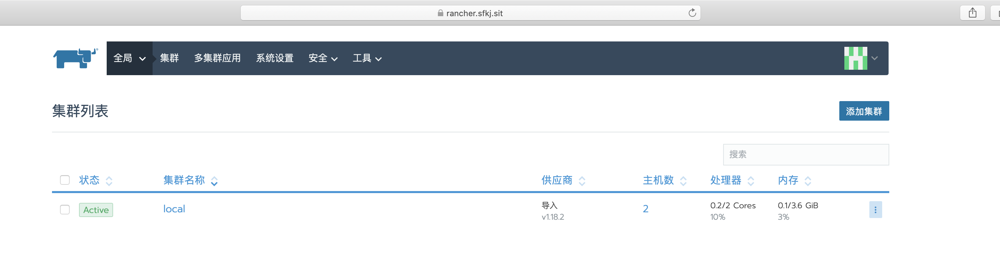
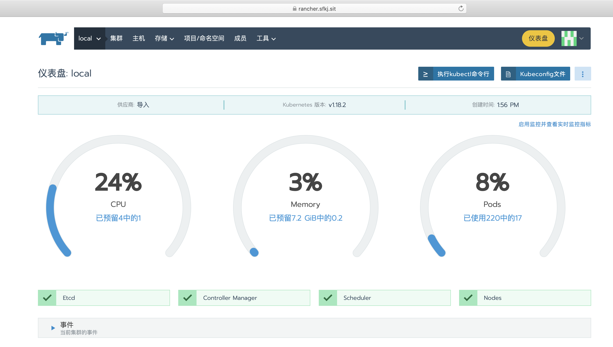

# 🍇 Rancher

#### [官方文档](https://rancher.com/docs/rancher/latest/en/)&#x20;

## 1、简介

Rancher是一个开源软件平台，使组织能够在生产中运行和管理Docker和Kubernetes。使用Rancher，组织不再需要使用一套独特的开源技术从头开始构建容器服务平台。Rancher提供了管理生产中的容器所需的整个软件堆栈。

## 2、主要组件

### 2.1、INFRASTRUCTURE ORCHESTRATION  基础架构流程

Rancher以Linux主机的形式从任何公共或私有云中获取原始计算资源。每个Linux主机可以是虚拟机或物理机。Rancher对每个主机的期望不超过CPU，内存，本地磁盘存储和网络连接。从Rancher的角度来看，来自云提供商的VM实例和托管在云设施中的裸机服务器是无法区分的。

Rancher实现了可移植的基础结构服务层，专门为容器化应用程序提供动力。Rancher基础架构服务包括网络，存储，负载平衡器，DNS和安全性。Rancher基础结构服务通常本身是作为容器部署的，因此同一Rancher基础结构服务可以在来自任何云的任何Linux主机上运行。

### 2.2、容器编排和调度  CONTAINER ORCHESTRATION AND SCHEDULING

许多用户选择使用容器编排和调度框架来运行容器化的应用程序。Rancher分发了当今所有流行的容器编排和调度框架，包括Docker Swarm，Kubernetes和Mesos。同一用户可以创建多个Swarm或Kubernetes集群。然后，他们可以使用本机Swarm或Kubernetes工具来管理其应用程序。

除了Swarm，Kubernetes和Mesos外，Rancher还支持其自己的称为Cattle的容器编排和调度框架。Rancher广泛使用Cattle来协调基础架构服务以及设置，管理和升级Swarm，Kubernetes和Mesos集群。

### 2.3、应用目录 APPLICATION CATALOG

Rancher用户只需单击一下按钮，即可从应用程序目录中部署整个多容器集群应用程序。当新版本的应用程序可用时，用户可以管理已部署的应用程序并执行全自动升级。Rancher维护由Rancher社区贡献的流行应用程序组成的公共目录。Rancher用户可以创建自己的私有目录。

### 2.4、企业级控制 ENTERPRISE-GRADE CONTROL

Rancher支持灵活的用户身份验证插件，并与Active Directory，LDAP和GitHub进行了预先构建的用户身份验证集成。Rancher在环境级别支持基于角色的访问控制（RBAC），允许用户和组共享或拒绝对开发和生产环境的访问。

### 2.5、Rancher的主要组件和功能。


### 2.6、为什么使用rancher？

**Rancher是供采用容器的团队使用的完整软件堆栈。它解决了在任何基础架构上管理多个Kubernetes集群的运营和安全挑战，同时为DevOps团队提供了用于运行容器化工作负载的集成工具**。\
用户不需要深入了解kubernetes概念就可以使用rancher，rancher包含应用商店，支持一键部署helm和compose模板。rancher通过各种云、本地生态系统产品认证，其中包括安全工具，监控系统，容器仓库以及存储和网络驱动程序，下图说明rancher在IT和DevOps组织中扮演的角色，每个团队都会在他们选择的公共云或私有云上部署应用

### 2.7、主要功能

* 内置CI/CD；&#x20;
* 告警和日志收集；&#x20;
* 多集群管理；&#x20;
* rancher kubernetes engine（RKE）;&#x20;
* 与云Kubernetes服务（如GKE,EKS和AKS）集成；

## 3、安装部署

### 3.1、单机容器启动

```
docker run -d --restart=always --name rancher -p 80:80 -p 443:443 rancher/rancher:stable
```

### 3.2、helm3部署rancher

```
helm repo add rancher-stable https://releases.rancher.com/server-charts/stable

[root@k8s-node001 kubernetes]# helm search repo
NAME                  	CHART VERSION	APP VERSION	DESCRIPTION
rancher-stable/rancher	2.4.5        	v2.4.5     	Install Rancher Server to manage Kubernetes clu... 
```

#### 自签证书安装过程

#### 生成自定义证书，本案例使用自定义域名为rancher.sfkj.sit



```
chmod +x create_self-signed-cert.sh
./create_self-signed-cert.sh --ssl-domain=rancher.sfkj.sit


[root@k8s-node001 tls]# ll
总用量 44
-rw-r--r-- 1 root root 1131 7月  21 11:50 cacerts.pem
-rw-r--r-- 1 root root   17 7月  21 11:50 cacerts.srl
-rw-r--r-- 1 root root 1675 7月  21 11:50 cakey.pem
-rwxr-xr-x 1 root root 5220 7月  21 11:49 create_self-signed-cert.sh
-rw-r--r-- 1 root root  241 7月  21 11:50 openssl.cnf
-rw-r--r-- 1 root root 2238 7月  21 11:50 rancher.sfkj.sit.crt
-rw-r--r-- 1 root root 1017 7月  21 11:50 rancher.sfkj.sit.csr
-rw-r--r-- 1 root root 1679 7月  21 11:50 rancher.sfkj.sit.key
-rw-r--r-- 1 root root 2238 7月  21 11:50 tls.crt
-rw-r--r-- 1 root root 1679 7月  21 11:50 tls.key
```



```
#!/bin/bash -e

help ()
{
    echo  ' ================================================================ '
    echo  ' --ssl-domain: 生成ssl证书需要的主域名，如不指定则默认为www.rancher.local，如果是ip访问服务，则可忽略；'
    echo  ' --ssl-trusted-ip: 一般ssl证书只信任域名的访问请求，有时候需要使用ip去访问server，那么需要给ssl证书添加扩展IP，多个IP用逗号隔开；'
    echo  ' --ssl-trusted-domain: 如果想多个域名访问，则添加扩展域名（SSL_TRUSTED_DOMAIN）,多个扩展域名用逗号隔开；'
    echo  ' --ssl-size: ssl加密位数，默认2048；'
    echo  ' --ssl-cn: 国家代码(2个字母的代号),默认CN;'
    echo  ' 使用示例:'
    echo  ' ./create_self-signed-cert.sh --ssl-domain=www.test.com --ssl-trusted-domain=www.test2.com \ '
    echo  ' --ssl-trusted-ip=1.1.1.1,2.2.2.2,3.3.3.3 --ssl-size=2048 --ssl-date=3650'
    echo  ' ================================================================'
}

case "$1" in
    -h|--help) help; exit;;
esac

if [[ $1 == '' ]];then
    help;
    exit;
fi

CMDOPTS="$*"
for OPTS in $CMDOPTS;
do
    key=$(echo ${OPTS} | awk -F"=" '{print $1}' )
    value=$(echo ${OPTS} | awk -F"=" '{print $2}' )
    case "$key" in
        --ssl-domain) SSL_DOMAIN=$value ;;
        --ssl-trusted-ip) SSL_TRUSTED_IP=$value ;;
        --ssl-trusted-domain) SSL_TRUSTED_DOMAIN=$value ;;
        --ssl-size) SSL_SIZE=$value ;;
        --ssl-date) SSL_DATE=$value ;;
        --ca-date) CA_DATE=$value ;;
        --ssl-cn) CN=$value ;;
    esac
done

# CA相关配置
CA_DATE=${CA_DATE:-3650}
CA_KEY=${CA_KEY:-cakey.pem}
CA_CERT=${CA_CERT:-cacerts.pem}
CA_DOMAIN=cattle-ca

# ssl相关配置
SSL_CONFIG=${SSL_CONFIG:-$PWD/openssl.cnf}
SSL_DOMAIN=${SSL_DOMAIN:-'www.rancher.local'}
SSL_DATE=${SSL_DATE:-3650}
SSL_SIZE=${SSL_SIZE:-2048}

## 国家代码(2个字母的代号),默认CN;
CN=${CN:-CN}

SSL_KEY=$SSL_DOMAIN.key
SSL_CSR=$SSL_DOMAIN.csr
SSL_CERT=$SSL_DOMAIN.crt

echo -e "\033[32m ---------------------------- \033[0m"
echo -e "\033[32m       | 生成 SSL Cert |       \033[0m"
echo -e "\033[32m ---------------------------- \033[0m"

if [[ -e ./${CA_KEY} ]]; then
    echo -e "\033[32m ====> 1. 发现已存在CA私钥，备份"${CA_KEY}"为"${CA_KEY}"-bak，然后重新创建 \033[0m"
    mv ${CA_KEY} "${CA_KEY}"-bak
    openssl genrsa -out ${CA_KEY} ${SSL_SIZE}
else
    echo -e "\033[32m ====> 1. 生成新的CA私钥 ${CA_KEY} \033[0m"
    openssl genrsa -out ${CA_KEY} ${SSL_SIZE}
fi

if [[ -e ./${CA_CERT} ]]; then
    echo -e "\033[32m ====> 2. 发现已存在CA证书，先备份"${CA_CERT}"为"${CA_CERT}"-bak，然后重新创建 \033[0m"
    mv ${CA_CERT} "${CA_CERT}"-bak
    openssl req -x509 -sha256 -new -nodes -key ${CA_KEY} -days ${CA_DATE} -out ${CA_CERT} -subj "/C=${CN}/CN=${CA_DOMAIN}"
else
    echo -e "\033[32m ====> 2. 生成新的CA证书 ${CA_CERT} \033[0m"
    openssl req -x509 -sha256 -new -nodes -key ${CA_KEY} -days ${CA_DATE} -out ${CA_CERT} -subj "/C=${CN}/CN=${CA_DOMAIN}"
fi

echo -e "\033[32m ====> 3. 生成Openssl配置文件 ${SSL_CONFIG} \033[0m"
cat > ${SSL_CONFIG} <<EOM
[req]
req_extensions = v3_req
distinguished_name = req_distinguished_name
[req_distinguished_name]
[ v3_req ]
basicConstraints = CA:FALSE
keyUsage = nonRepudiation, digitalSignature, keyEncipherment
extendedKeyUsage = clientAuth, serverAuth
EOM

if [[ -n ${SSL_TRUSTED_IP} || -n ${SSL_TRUSTED_DOMAIN} ]]; then
    cat >> ${SSL_CONFIG} <<EOM
subjectAltName = @alt_names
[alt_names]
EOM
    IFS=","
    dns=(${SSL_TRUSTED_DOMAIN})
    dns+=(${SSL_DOMAIN})
    for i in "${!dns[@]}"; do
      echo DNS.$((i+1)) = ${dns[$i]} >> ${SSL_CONFIG}
    done

    if [[ -n ${SSL_TRUSTED_IP} ]]; then
        ip=(${SSL_TRUSTED_IP})
        for i in "${!ip[@]}"; do
          echo IP.$((i+1)) = ${ip[$i]} >> ${SSL_CONFIG}
        done
    fi
fi

echo -e "\033[32m ====> 4. 生成服务SSL KEY ${SSL_KEY} \033[0m"
openssl genrsa -out ${SSL_KEY} ${SSL_SIZE}

echo -e "\033[32m ====> 5. 生成服务SSL CSR ${SSL_CSR} \033[0m"
openssl req -sha256 -new -key ${SSL_KEY} -out ${SSL_CSR} -subj "/C=${CN}/CN=${SSL_DOMAIN}" -config ${SSL_CONFIG}

echo -e "\033[32m ====> 6. 生成服务SSL CERT ${SSL_CERT} \033[0m"
openssl x509 -sha256 -req -in ${SSL_CSR} -CA ${CA_CERT} \
    -CAkey ${CA_KEY} -CAcreateserial -out ${SSL_CERT} \
    -days ${SSL_DATE} -extensions v3_req \
    -extfile ${SSL_CONFIG}

echo -e "\033[32m ====> 7. 证书制作完成 \033[0m"
echo
echo -e "\033[32m ====> 8. 以YAML格式输出结果 \033[0m"
echo "----------------------------------------------------------"
echo "ca_key: |"
cat $CA_KEY | sed 's/^/  /'
echo
echo "ca_cert: |"
cat $CA_CERT | sed 's/^/  /'
echo
echo "ssl_key: |"
cat $SSL_KEY | sed 's/^/  /'
echo
echo "ssl_csr: |"
cat $SSL_CSR | sed 's/^/  /'
echo
echo "ssl_cert: |"
cat $SSL_CERT | sed 's/^/  /'
echo

echo -e "\033[32m ====> 9. 附加CA证书到Cert文件 \033[0m"
cat ${CA_CERT} >> ${SSL_CERT}
echo "ssl_cert: |"
cat $SSL_CERT | sed 's/^/  /'
echo

echo -e "\033[32m ====> 10. 重命名服务证书 \033[0m"
echo "cp ${SSL_DOMAIN}.key tls.key"
cp ${SSL_DOMAIN}.key tls.key
echo "cp ${SSL_DOMAIN}.crt tls.crt"
cp ${SSL_DOMAIN}.crt tls.crt
```



### 3.3、使用helm安装rancher

```
# 创建namespace
kubectl create namespace cattle-system
# 服务证书和私钥密文
kubectl -n cattle-system create secret tls tls-rancher-ingress --cert=./tls.crt --key=./tls.key
# ca 证书密文
kubectl -n cattle-system create secret generic tls-ca --from-file=./cacerts.pem
# 安装rancher server
helm install rancher  rancher-stable/rancher --namespace cattle-system --set hostname=rancher.sfkj.sit --set ingress.tls.source=secret --set privateCA=true
```

#### 查看结果

```
[root@k8s-node001 tls]# kubectl get all -n cattle-system
NAME                           READY   STATUS    RESTARTS   AGE
pod/rancher-64b9795c65-6mk6c   1/1     Running   0          28m
pod/rancher-64b9795c65-rn88w   1/1     Running   0          28m
pod/rancher-64b9795c65-tjzvx   1/1     Running   1          28m

NAME              TYPE        CLUSTER-IP       EXTERNAL-IP   PORT(S)   AGE
service/rancher   ClusterIP   10.102.202.133   <none>        80/TCP    28m

NAME                      READY   UP-TO-DATE   AVAILABLE   AGE
deployment.apps/rancher   3/3     3            3           28m

NAME                                 DESIRED   CURRENT   READY   AGE
replicaset.apps/rancher-64b9795c65   3         3         3       28m
```


默认ingress插件为nginx-ingress, 如果使用的是traefik需先更改ingress，yaml如下：


```
apiVersion: extensions/v1beta1
kind: Ingress
metadata:
  annotations:
    meta.helm.sh/release-name: rancher
    meta.helm.sh/release-namespace: cattle-system
    kubernetes.io/ingress.class: traefik
    traefik.ingress.kubernetes.io/router.tls: "true"
    traefik.ingress.kubernetes.io/router.entrypoints: websecure
  name: rancher
  namespace: cattle-system

spec:
  rules:
  - host: rancher.sfkj.sit
    http:
      paths:
      - backend:
          serviceName: rancher
          servicePort: 80
  tls:
  - secretName: tls-rancher-ingress
status:
  loadBalancer: {}
```

#### nginx增加如下配置

```
upstream https_backend_traefik {
    #server k8s-node001:8181    max_fails=3 fail_timeout=10s;
    server k8s-node002:8443    max_fails=3 fail_timeout=10s;
    #server 10.105.28.224:8080   max_fails=3 fail_timeout=10s;
}

server {
    listen 443 ssl;
    server_name rancher.sfkj.sit;
    #ssl on;
    ssl_session_cache   shared:SSL:10m;
    ssl_session_timeout 10m;

    ssl_certificate /data/kubernetes/tls/tls.crt;
    ssl_certificate_key  /data/kubernetes/tls/tls.key;

    location / {
        proxy_pass https://https_backend_traefik;
        proxy_http_version 1.1;
        proxy_set_header Upgrade $http_upgrade;
        proxy_set_header Connection upgrade;
        proxy_set_header Host       $http_host;
        proxy_set_header x-forwarded-for $proxy_add_x_forwarded_for;
    }
}
```

#### 为Agent Pod添加主机别名(/etc/hosts)

如果您没有内部DNS服务器而是通过添加`/etc/hosts`主机别名的方式指定的Rancher Server域名，那么不管通过哪种方式(自定义、导入、Host驱动等)创建K8S集群，K8S集群运行起来之后，因为`cattle-cluster-agent Pod`和`cattle-node-agent pod`无法通过DNS记录找到`Rancher Server URL`,最终导致无法通信。

解决办法：可以通过给`cattle-cluster-agent Pod`和`cattle-node-agent pod`添加主机别名(/etc/hosts)，让其可以正常通过`Rancher Server URL`与Rancher Server通信`(前提是IP地址可以互通)`。

具体操作如下：

```

kubectl -n cattle-system patch  deployments cattle-cluster-agent --patch '{
    "spec": {
        "template": {
            "spec": {
                "hostAliases": [
                    {
                        "hostnames":
                        [
                            "rancher.sfkj.sit"
                        ],
                            "ip": "172.24.19.168"
                    }
                ]
            }
        }
    }
}'

kubectl -n cattle-system patch  daemonsets cattle-node-agent --patch '{
    "spec": {
        "template": {
            "spec": {
                "hostAliases": [
                    {
                        "hostnames":
                        [
                            "rancher.sfkj.sit"
                        ],
                            "ip": "172.24.19.168"
                    }
                ]
            }
        }
    }
}'
```

#### 在/etc/hosts 增加解析





#### 参考

[**Helm 安装rancher**](https://docs.rancher.cn/rancher2x/installation/helm-ha-install/online/tcp-l4/rancher-install.html)&#x20;

