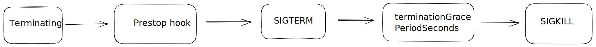

# 🍒 优雅终止

## 1、介绍

所谓优雅终止，就是保证在销毁 Pod 的时候保证对业务无损，比如在业务发版时，让工作负载能够平滑滚动更新。 Pod 在销毁时，会停止容器内的进程，通常在停止的过程中我们需要执行一些善后逻辑，比如等待存量请求处理完以避免连接中断，或通知相关依赖进行清理等，从而实现优雅终止目的。

### 1.1 pod 销毁流程



1、Pod 被删除，状态变为 `Terminating`。从 API 层面看就是 Pod metadata 中的 deletionTimestamp 字段会被标记上删除时间。

2、kube-proxy watch 到了就开始更新转发规则，将 Pod 从 service 的 endpoint 列表中摘除掉，新的流量不再转发到该 Pod。

3、kubelet watch 到了就开始销毁 Pod。

* 如果 Pod 中有 container 配置了 [preStop Hook](https://kubernetes.io/docs/concepts/containers/container-lifecycle-hooks/) ，将会执行。
* 发送 `SIGTERM` 信号给容器内主进程以通知容器进程开始优雅停止。
* 等待 container 中的主进程完全停止，如果在 `terminationGracePeriodSeconds` 内 (默认 30s) 还未完全停止，就发送 `SIGKILL` 信号将其强制杀死。
* 所有容器进程终止，清理 Pod 资源。
* 通知 APIServer Pod 销毁完成，完成 Pod 删除。

### 1.2 业务代码处理SIGTERM 信号

要实现优雅终止，首先业务代码得支持下优雅终止的逻辑，在业务代码里面处理下 `SIGTERM` 信号，一般主要逻辑就是"排水"，即等待存量的任务或连接完全结束，再退出进程。

以下为各种语言的代码示例



```sh
#!/bin/sh

## Redirecting Filehanders
ln -sf /proc/$$/fd/1 /log/stdout.log
ln -sf /proc/$$/fd/2 /log/stderr.log

## Pre execution handler
pre_execution_handler() {
  ## Pre Execution
  # TODO: put your pre execution steps here
  : # delete this nop
}

## Post execution handler
post_execution_handler() {
  ## Post Execution
  # TODO: put your post execution steps here
  : # delete this nop
}

## Sigterm Handler
sigterm_handler() { 
  if [ $pid -ne 0 ]; then
    # the above if statement is important because it ensures 
    # that the application has already started. without it you
    # could attempt cleanup steps if the application failed to
    # start, causing errors.
    kill -15 "$pid"
    wait "$pid"
    post_execution_handler
  fi
  exit 143; # 128 + 15 -- SIGTERM
}

## Setup signal trap
# on callback execute the specified handler
trap 'sigterm_handler' SIGTERM

## Initialization
pre_execution_handler

## Start Process
# run process in background and record PID
>/log/stdout.log 2>/log/stderr.log "$@" &
pid="$!"
# Application can log to stdout/stderr, /log/stdout.log or /log/stderr.log

## Wait forever until app dies
wait "$pid"
return_code="$?"

## Cleanup
post_execution_handler
# echo the return code of the application
exit $return_code

```



```go
package main

import (
    "fmt"
    "os"
    "os/signal"
    "syscall"
)

func main() {

    sigs := make(chan os.Signal, 1)
    done := make(chan bool, 1)
    //registers the channel
    signal.Notify(sigs, syscall.SIGTERM)

    go func() {
        sig := <-sigs
        fmt.Println("Caught SIGTERM, shutting down")
        // Finish any outstanding requests, then...
        done <- true
    }()

    fmt.Println("Starting application")
    // Main logic goes here
    <-done
    fmt.Println("exiting")
}

```



```python
import signal, time, os

def shutdown(signum, frame):
    print('Caught SIGTERM, shutting down')
    # Finish any outstanding requests, then...
    exit(0)

if __name__ == '__main__':
    # Register handler
    signal.signal(signal.SIGTERM, shutdown)
    # Main logic goes here

```



```
process.on('SIGTERM', () => {
  console.log('The service is about to shut down!');
  
  // Finish any outstanding requests, then...
  process.exit(0); 
});

```



```javascript
import sun.misc.Signal;
import sun.misc.SignalHandler;
 
public class ExampleSignalHandler {
    public static void main(String... args) throws InterruptedException {
        final long start = System.nanoTime();
        Signal.handle(new Signal("TERM"), new SignalHandler() {
            public void handle(Signal sig) {
                System.out.format("\nProgram execution took %f seconds\n", (System.nanoTime() - start) / 1e9f);
                System.exit(0);
            }
        });
        int counter = 0;
        while(true) {
            System.out.println(counter++);
            Thread.sleep(500);
        }
    }
}

```



1.3 合理使用prestop

若你的业务代码中没有处理 `SIGTERM` 信号，或者你无法控制使用的第三方库或系统来增加优雅终止的逻辑，也可以尝试为 Pod 配置下 preStop，在这里面实现优雅终止的逻辑，示例:

```yaml
        lifecycle:
          preStop:
            exec:
              command:
              - /clean.sh          
```

在某些极端情况下，Pod 被删除的一小段时间内，仍然可能有新连接被转发过来，因为 kubelet 与 kube-proxy 同时 watch 到 pod 被删除，kubelet 有可能在 kube-proxy 同步完规则前就已经停止容器了，这时可能导致一些新的连接被转发到正在删除的 Pod，而通常情况下，当应用受到 `SIGTERM` 后都不再接受新连接，只保持存量连接继续处理，所以就可能导致 Pod 删除的瞬间部分请求失败。

这种情况下，我们也可以利用 preStop 先 sleep 一小下，等待 kube-proxy 完成规则同步再开始停止容器内进程:

```yaml
        lifecycle:
          preStop:
            exec:
              command:
              - sleep
              - 5s
```

1.4 长连接场景

如果业务是长链接场景，比如游戏、会议、直播等，客户端与服务端会保持着长链接:

销毁 Pod 时需要的优雅终止的时间通常比较长 (preStop + 业务进程停止超过 30s)，有的极端情况甚至可能长达数小时，这时候可以根据实际情况自定义 `terminationGracePeriodSeconds`，避免过早的被 `SIGKILL` 杀死。

具体设置多大可以根据业务场景最坏的情况来预估，比如对战类游戏场景，同一房间玩家的客户端都连接的同一个服务端 Pod，一轮游戏最长半个小时，那么我们就设置 `terminationGracePeriodSeconds` 为 1800。

如果不好预估最坏的情况，最好在业务层面优化下，比如 Pod 销毁时的优雅终止逻辑里面主动通知下客户端，让客户端连到新的后端，然后客户端来保证这两个连接的平滑切换。等旧 Pod 上所有客户端连接都连切换到了新 Pod 上，才最终退出
